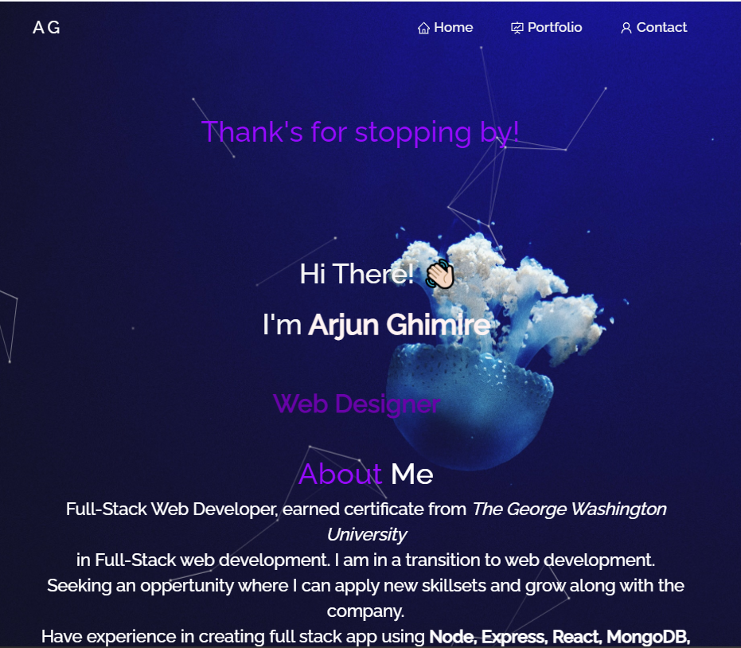
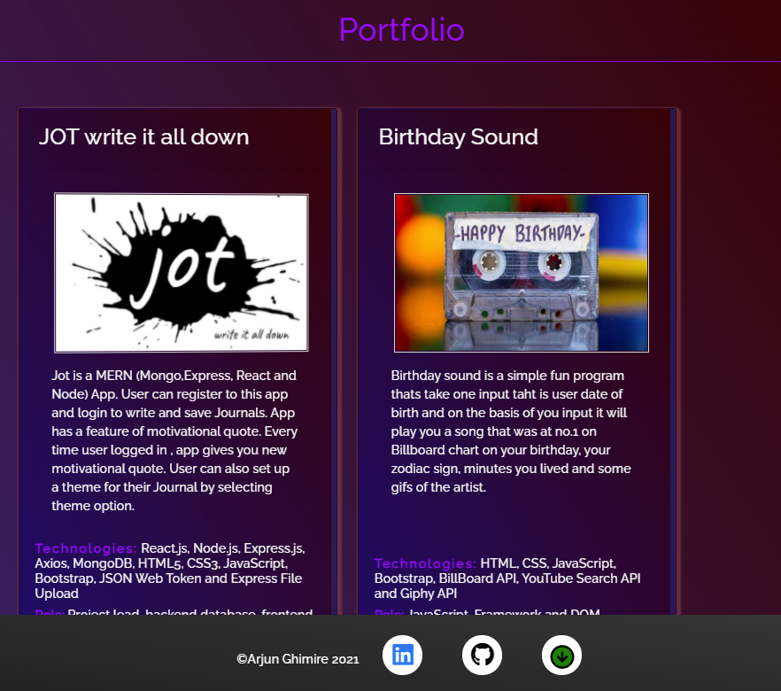

# react-portfolio
# Table of Contents
- [Description](#Description)
-[Technologies](#Technologies)
- [Installation](#Installation)
- [Deployment](#Deployment)
- [Screensgots](#Screenshoots)

## Description
Portfolio created using react app. 

## Technologies 
- react
- react-bootstrap
- react-scroll
- typewriter-effect
- react-parallax-tilt
- react-dom
- github-pages

## Installation
- Clone the repo on local machine,
- Install dependencies (npm i)
- In the terminal navigate to the source folder and lunch the app by typing npm start.
- Navigate to the src foder and make changes to the pages and components according to need.

## Deployment
- Deployed app https://ghimirear.github.io/react-portfolio/

## Screenshots

